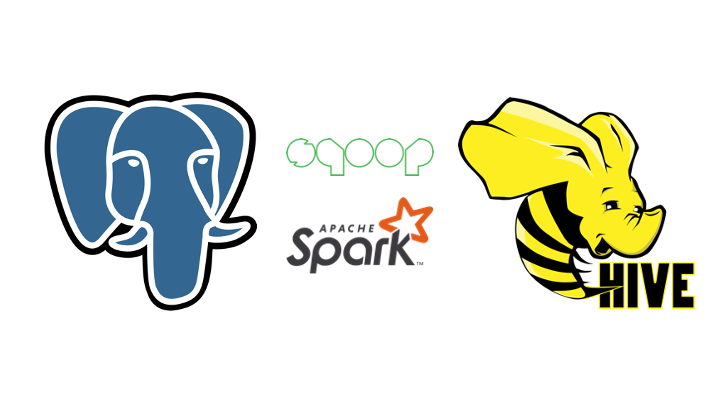

# RDBMS to HDFS data pipeline



This project aims to move the data from a Relational database system (RDBMS) to a Hadoop file system (HDFS). Here are the technology stacks we will use in this project.
- PostgreSQL 
- Apache Sqoop
- Apache Hive
- Apache Spark

# The learning objectives 
1. To create a modified `docker` file based on your use cases.
2. To know how to set up the component with `docker` in both traditional and distributed environments.
3. To craft a data pipeline for moving data from the traditional system to the distributed system.
4. To learn how to communicate between containers in the same environment.
5. To build data quality checkers in the intermediate step of the data pipeline.
6. To be familiar with the basic usage of `sqoop`, `hive`, and `spark`.

# Required

1. Docker desktop
2. Docker compose

# Architecture compatability
- [X] `linux/amd64`

# How to run this project
I provide you a docker-compose file so that you can run the whole application with the following command.

```
docker-compose up -d
```

Then you can access the Airflow UI webserver through port 8080
- http://localhost:8080

Please feel free to turn the dag button on for the `hands_on_test`.
It sets a `start_date` to days_ago(1) and schedule to run on a daily basis.

Assume that the pipeline is run completely. You can test the result on the following components like this.

## PostgresSQL

```
# show table in database
docker exec postgres-db psql -U postgres -d lineman_wongnai -c \\dt
```
```
# describe table
docker exec postgres-db psql -U postgres -d lineman_wongnai -c "
SELECT 
   table_name, 
   column_name, 
   data_type 
FROM 
   information_schema.columns
WHERE 
   table_name = '<<TARGET TABLE>>';
"
# change <<TARGET TABLE>> to your table name e.g., 'order_detail', 'restaurant_detail'
```
```
# sample data
docker exec postgres-db psql -U postgres -d lineman_wongnai -c "SELECT * FROM <<TARGET TABLE>> LIMIT 5;"

# change <<TARGET TABLE>> to your table name e.g., 'order_detail', 'restaurant_detail'
```

## HIVE

```
# show tables
docker exec hive-server beeline -u jdbc:hive2://localhost:10000/default -e "SHOW TABLES;"
```

```
# describe table
docker exec hive-server beeline -u jdbc:hive2://localhost:10000/default -e "SHOW CREATE TABLE <<TARGET TABLE>>;"

# change <<TARGET TABLE>> to your table name e.g., 'order_detail', 'restaurant_detail'
```

```
# sample data
docker exec hive-server beeline -u jdbc:hive2://localhost:10000/default -e "SELECT * FROM <<TARGET TABLE>> LIMIT 5;"

# change <<TARGET TABLE>> to your table name e.g., 'order_detail', 'restaurant_detail'
```

```
# check partitioned parquet
docker exec hive-server hdfs dfs -ls /user/spark/transformed_order_detail
docker exec hive-server hdfs dfs -ls /user/spark/transformed_restaurant_detail

# check the source of external table in ./airflow/scripts/hql script.
```

For SQL requirement files, the CSV files will be placed in the `./sql_result` when the dag is completed.

After you finish the test, you can close the whole application by
```
docker-compose down -v
```

# Troubleshooting

1. Cannot spin up docker-compose because the port has been used. 
    - check the mapping port on the host machine in `docker-compose.yaml` file. Changing it to another open port. e.g., `'10000:'10000'` to `'10001:10000'`
2. If you use `arm64` architecture to run this project, the `import_sqoop` task will be failed. Please swith to run it in the `linux/amd64` architecture.


#  Business requirement
1. Create two tables in postgres database with the above given column types.
    - [X] order_detail table using `order_detail.csv`
    - [X] restaurant_detail table using `restaurant_detail.csv`
    - Check `COPY` command in `airflow/dags/script/sql_queries.py`

2. Once we have these two tables in postgres DB, ETL the same tables to Hive with the same names and corresponding Hive data type using the below guidelines
    - [X] Both the tables should be `external table`
    - [X] Both the tables should have `parquet file format`
    - [X] restaurant_detail table should be partitioned by a column name `dt` (type string) with a static value `latest`
    - [X] order_detail table should be partitioned by a column named `dt` (type string) extracted from `order_created_timestamp` in the format `YYYYMMDD`
    - Check `DESCRIBE TABLE` and `SAMPLE DATA` commands in the previous HIVE section.

3. After creating the above tables in Hive, create two new tables __order_detail_new__ and __restaurant_detail_new__ with their respective columns and partitions and add one new column for each table as explained below.
    - [X] `discount_no_null` - replace all the NULL values of discount column with 0
    - [X] `cooking_bin` - using esimated_cooking_time column and the below logic
        - I saw that there are a gap for the estimated cooking time below 10 minutes, so I set the default value for outside the provided logic to be `null` value.
    - Check `SAMPLE DATA` commands in the previous HIVE section. You can edit query to test the requirement such as `SELECT COUNT(*) FROM order_detail_new WHERE discount_no_null IS NULL`. The expected result would be 0.
    
    |estimated_cooking_time |cooking_bin|
    |-----  |--------   |
    |10-40  |1          |
    |41-80  |2          |
    |81-120 |3          |
    |> 120  |4          |

4. Final column count of each table (including partition column):

    - [X] order_detail = 9
    - [X] restaurant_detail = 7
    - [X] order_detail_new = 10
    - [X] restaurant_detail_new = 8 
    - Check `DESCRIBE TABLE` command in the previous HIVE section.

5. SQL requirements & CSV output requirements
    - [X] Get the average discount for each category
        - I'm not sure whether you need the average of `discount` or `discount_no_null` columns, so I calculate it both. It could lead to different business interpretation.
    - [X] Row count per each cooking_bin
    - Check the result in `./sql_result` for `discount.csv` and `cooking.csv`

# Technical Requirements
- [X] Use Apache Spark, Apache Sqoop or any other big data frameworks
- [X] Use a scheduler tool to run the pipeline daily. Airflow is preferred
- [X] Include a README file that explains how we can deploy your code
- [X] (bonus) Use Docker or Kubernetes for up-and-running program

## DAG


## DAG overviews

1. We orchestrate and schedule this project with `airflow`. It will run on a daily basis. Each task will have 1 times retry.
2. For the postgres, part we use the `PostgresOperator` to submit the SQL script provided in `airflow/scripts/sql_queries.py` to create postgres tables.
3. We provide a custom `PostgresDataQualityOperator` to check that the number of row for each table matched with the source data in `./data` folder.
4. For the second part of this pipeline, we ingest data from RDBMS system to HDFS system with `sqoop`. Unfortunately, with the best understanding I have about the HADOOP ecosystem, I can't set up the `sqoop` container for isolating this operation. So, I work around by installing `sqoop` component in `hive-server`. Then I use the `BashOperator` to ingest the data from shell script. The data will be placed in `hive-server` hdfs filesystem under `/user/sqoop/` folder. For the source code and required components for sqoop you can find it in `./airflow/othres/sqoop`
6. Also, for the hive and spark components, I found trouble to use the `SparkSubmitOperator`, and `HiveOperator` from the `airflow` containers. So I work around by modified the airflow docker image to be able to use the `docker` command within the container. You can find the script to build that image in `dockerfile` and `requirements.txt` files.  I have already pushed modified image to docker hub so you don't to to build it yourself.
7. With the docker command within the airflow container, I can continue working on the spark and hive things through the `docker exec` command. It use the `BashOperator` to run those scripts. For spark script, you can find the source code in `./airflow/dags/scripts/spark`. For hive script, you can find the source code in `./airflow/dags/scripts/hive`
8. For both `Postgres` and `Hive` I use the `drop-create` style . For the spark output, the default mode is `overwrite`. 
9. For sql requirement, when the dag is completed the csv files will be placed in `./sql_result` folder.

# Question output
- [X] Source code 
- [X] Docker, docker-compose, kubernetes files if possible.
- [X] README of how to test / run


